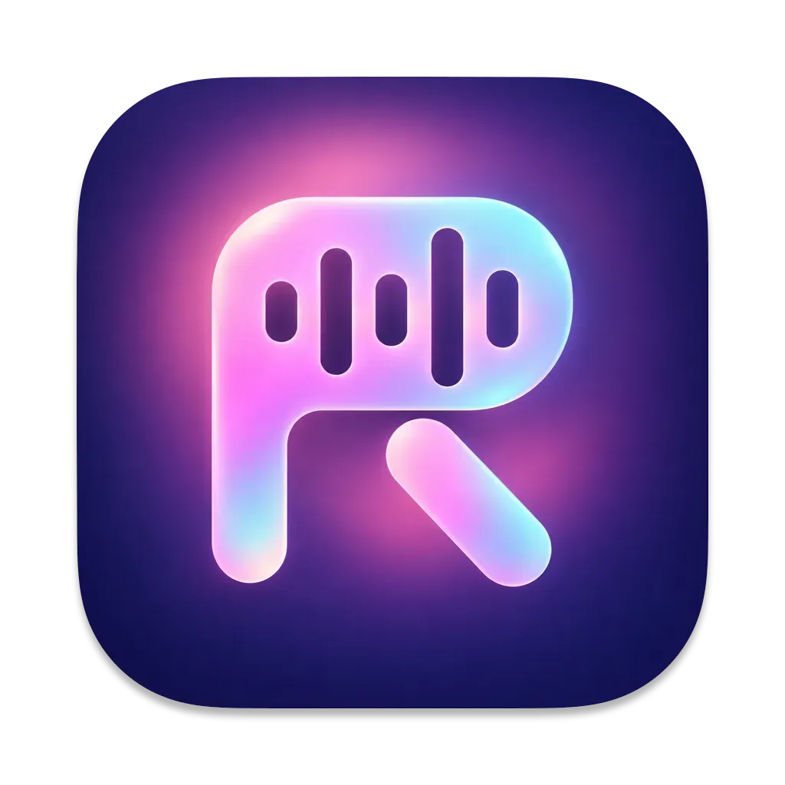
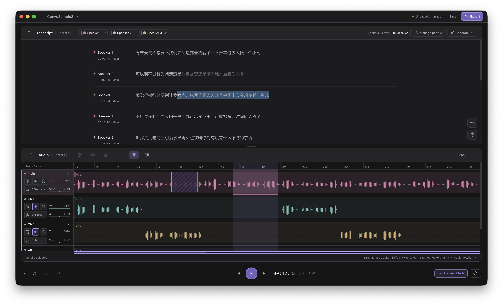

<p align="center">
  
</p>

<h1 align="center">RedenCut</h1>

<p align="center">
  <strong>Edit your podcast through its transcript.</strong><br />
  A local-first audio editor with text-based cuts, a multitrack timeline, and on-device speech analysis.
</p>

<p align="center">
  <a href="#features">Features</a> ·
  <a href="#getting-started">Getting started</a> ·
  <a href="#local-speech-analysis">Speech analysis</a> ·
  <a href="#development">Development</a> ·
  <a href="ROADMAP.md">Roadmap</a>
</p>

<p align="center">English</p>

> **Development preview:** RedenCut currently targets macOS and runs from source.
> Standalone packaging, runtime bundling, and signing are still in progress.

## What is RedenCut?

RedenCut is an audio editor specifically designed for podcast editing.
Import a recording, generate a transcript using on-device AI, select the words you want to remove, and listen back to the edit.
Use the waveform and multitrack timeline to refine timing, arrange clips, and mix recordings before export.

Edits are non-destructive: cuts are stored in the project while the source audio stays intact.
You can restore removed passages, adjust their boundaries, and undo changes as you work.



## Features

- **Edit through text.** Click words to seek, follow word highlighting during playback, and select passages to redact their audio.
- **Refine cuts visually.** Move or resize redaction regions on the waveform, restore a passage, and preview playback with redacted sections skipped.
- **Arrange multiple tracks.** Split, trim, move, copy, paste, and duplicate clips; select multiple clips, snap edges, and insert at a seam.
- **Control your mix.** Rename tracks, adjust volume, and use mute and solo controls with synchronized playback.
- **Analyze speech locally.** Generate transcripts with whisper.cpp, align words with WhisperX, and optionally separate speakers with pyannote.audio.
- **Organize speakers.** Edit speaker names and colors, group people, and filter the transcript by speaker without muting their audio.
- **Save your workspace.** Keep edits and speech-analysis results in `.redencut` projects, with managed audio copies or external references.
- **Export finished audio.** Render MP3, WAV, FLAC, or AAC with track mixing, clip gain, and redactions applied.
- **Make the editor yours.** Choose light or dark themes, switch between English and Simplified Chinese, and resize or reorder the transcript and audio panels.

### Supported formats

| Operation | Formats |
| --- | --- |
| Import | WAV, MP3, FLAC, AAC, M4A, OGG, AIFF |
| Export | MP3, WAV, FLAC, AAC |
| Project | `.redencut` |

Decoding and encoding use FFmpeg; compatibility with individual files depends on the available codecs and the file itself.

## Getting started

### Availability

The current setup is intended for macOS development.
Windows support is planned; the Linux Docker environment is a development and testing harness, not a supported desktop release.

<!-- TODO before public launch: Add release download links, supported macOS versions and architectures, hardware recommendations, and signed/notarized installation instructions once verified. -->

### Run from source on macOS

Prerequisites:

- Git and Node.js **24.14.0**, the version pinned in `package.json`, with npm.
- Apple command-line developer tools, CMake, Ninja and pkg-config for the initial native runtime build.
- Internet access and disk space for the pinned source archives and Python dependencies.
- The managed runtime currently targets macOS ARM64; Windows and Intel macOS are not certified by this recipe.

```sh
git clone https://github.com/boningdong/RedenCut.git
cd RedenCut
npm ci

# Prepare the audio/Python runtime and optional speaker model.
npm run runtime:setup
npm run runtime:check

# Start the desktop app.
npm run dev
```

We recommend installing the local AI tools for the full transcript-based editing experience.
The setup command supplies the native tools, Python dependencies and optional diarization model together.
Whisper and alignment models are downloaded in the app.
You can skip AI model downloads and use RedenCut solely for waveform and multitrack audio editing.
Choose to skip speech preparation during onboarding; transcription, text-based editing, and speaker analysis will remain unavailable until you complete setup.
You can enable these features later through Settings after preparing the required models.

For text based editing, open **Settings → Models & dependencies**, validate the development environment, and download the text-editing models.
For optional speaker recognition in development, run `npm run runtime:setup` to prepare the managed model, then validate it under Runtime.
Release builds include this model and expose only the speaker-recognition toggle.
The app's model preparation does not install native executables or the Python environment.

See [speech models and dependencies](docs/speech-models-and-dependencies.md) for managed runtime, model caches, and setup details.
The app never falls back to a system/Homebrew FFmpeg, an npm static binary, or an unrelated Python environment; a missing or invalid managed runtime produces a setup error.

### Your first edit

1. Create a project and import audio through the file picker.
2. Generate a transcript for a track, or for all tracks, once speech resources are ready.
3. Click a word to hear its position, then select unwanted text and press **M** or **Delete** to redact it.
4. Use **Preview Mode** (on by default) to audition the cuts, and adjust their boundaries on the waveform.
5. Arrange clips and tracks, save the project, and export your audio.

**Redaction and mute have different effects.**
Redactions remove selected passages from the export and can be skipped during preview.
Clip and track mute control audibility; ordinary muted regions and natural gaps retain their timeline placement.
Export applies redactions even when **Preview Mode** is off.

For a portable project, use managed copies of the source audio.
Projects that reference external files still need those files to remain available.

## Local speech analysis

| Stage | Engine | Purpose |
| --- | --- | --- |
| Transcription | whisper.cpp | Produce the transcript from your recording |
| Word alignment | WhisperX with pinned alignment models | Match transcript words to audio timestamps |
| Optional speaker separation | pyannote.audio | Assign anonymous speaker labels to speech |

The current alignment models cover **English and Chinese**.
The multilingual transcription model does not imply full editing-pipeline support for every language; broader language support and mixed-language quality still need validation.
Speaker separation provides editable anonymous labels, not identification of real-world people.

### Downloads and privacy

Audio decoding, transcription, alignment, speaker analysis, and export run locally.
Once the required runtimes and models are installed, normal speech inference uses offline model loading and does not need a cloud transcription service.
Initial dependency installation and model downloads require internet access.

The setup terminal shows the current phase, an animated activity indicator and elapsed time; downloads with a known size also show byte-based percentages.
Redirected output uses plain progress lines, and model validation stays quiet unless it fails.

In local development, `npm run runtime:setup` guides you through Hugging Face access when the diarization model is missing.
Accept the model's conditions with your own account; supply a read token through the CLI's hidden prompt, `HF_TOKEN`, or an existing local HF login.
Verified models are reused without authentication and stored in `.runtime/models/diarization/<revision>/`, outside Git.
Use `npm run runtime:setup -- --skip-models` to skip this optional asset, or `--models-only` to prepare it after the native runtime is installed.
Settings and onboarding show model validation under Runtime; they never request or save HF credentials.
Packaged releases include the model, so end users only control the speaker-recognition switch.

Download Whisper and alignment models through Settings or onboarding.
`npm run setup:speech-models` provisions a separate developer worker cache; it does **not** populate the app's managed model library.

Model revisions, dependencies, access requirements, and environment details are recorded in [speech models and dependencies](docs/speech-models-and-dependencies.md) and the [model manifest](speech-worker/models.json).

## Keyboard shortcuts

| Shortcut | Action |
| --- | --- |
| Space | Play or pause |
| S | Split the selected clip at the playhead |
| M | Mute selected clips or redact a waveform/text selection |
| Delete / Backspace | Remove the selected clip or redaction overlay; redact a range/text selection |
| ⌘S | Save project |
| ⌘Z / ⌘⇧Z | Undo / redo |
| ⌘C / ⌘X / ⌘V | Copy / cut / paste clips when Audio has focus |
| ⌘D | Duplicate selected clips |
| ← / → | Seek backward / forward one second |
| ⇧← / ⇧→ | Seek backward / forward five seconds |

Shortcuts depend on focus and selection.
See the [full keyboard reference](docs/key-mappings.md) for editing contexts, track routing, and boundary adjustments.

## Development

RedenCut uses **Electron, React, TypeScript, and Zustand**, with FFmpeg for audio processing and a separate Python worker for alignment and speaker analysis.

| Directory | Responsibility |
| --- | --- |
| `src/main/` | Native dialogs, projects, audio processing, speech jobs, and managed resources |
| `src/preload/` | Narrow bridge between Electron and the renderer |
| `src/renderer/` | Editor UI, timeline interaction, and audio playback |
| `src/shared/` | Shared types, schemas, and IPC contracts |
| `speech-worker/` | Python speech worker, locked dependencies, and model manifest |
| `e2e/` and `harness/` | End-to-end scenarios and the Docker-based test harness |

```sh
npm run dev           # Start development
npm run build         # Build the app code (not a distributable installer)
npm run preview       # Preview the built app
npm test              # Run unit tests
npm run typecheck     # Check TypeScript
npm run check         # Formatting, lint, dead-code checks, types, tests, and build
```

See [architecture](docs/architecture-standards.md), [coding standards](docs/coding-standards.md), and the [test harness guide](harness/container/README.md) for more detail.
The scripts in [package.json](package.json) are the source of truth for development commands.

## Current limitations and roadmap

RedenCut is under active development.
The current implementation includes the editing and speech features described above, but release readiness and speech quality across representative recordings remain ongoing work.

Upcoming work includes:

- Standalone distribution, bundled runtimes, signing, and clean-machine installation verification.
- File-drop import and further timeline and accessibility polish.
- Loudness normalization, configurable crossfades, and richer export controls.
- Assisted filler-word detection and edit-transition review.
- A plugin system and assisted speech generation.

These are planned capabilities, not features available in the current app.
See [ROADMAP.md](ROADMAP.md) for the broader development plan.

## Contributing

RedenCut is currently maintained primarily by its main author.
Feature requests and bug reports are welcome through this repository's Issues.
For bug reports, include your OS and architecture, steps to reproduce, expected behavior, and relevant errors.
If an audio sample is needed, use a short recording you have permission to share.

We are not accepting large pull requests at this time.
If you would like to contribute, please contact the author by email before starting work so we can discuss the scope and direction.
We are still exploring how community contributions should work, and the contribution process will evolve as the project grows.

## Acknowledgments

RedenCut is built on Electron, React, FFmpeg, whisper.cpp, WhisperX, pyannote.audio, and the models listed in the speech manifest.
Their respective licenses and model access conditions apply independently.

## License

RedenCut original project code is licensed under the **Apache License 2.0 (Apache-2.0)**.
See [LICENSE](LICENSE) for the full license text.
Third-party dependencies and models remain subject to their respective licenses and access conditions.
