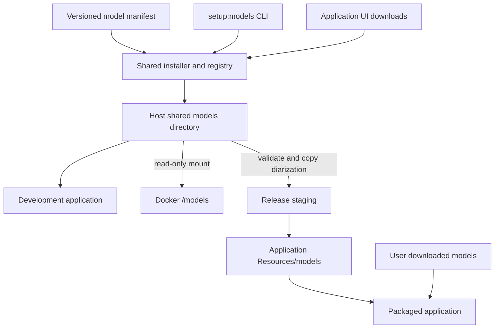
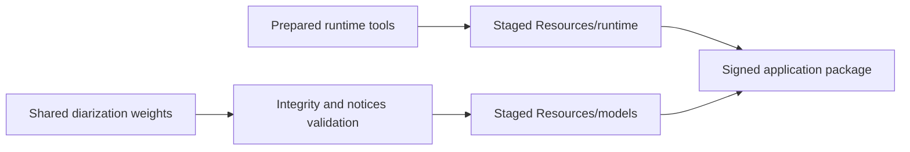

# Speech Models and Dependencies

## Architecture

This document defines model preparation, discovery, credentials and release storage for RedenCut speech features.
Exact models, immutable revisions, file sizes and integrity hashes live in [`speech-worker/models.json`](../speech-worker/models.json); Python dependencies are pinned by `speech-worker/pyproject.toml` and `speech-worker/uv.lock`.



The installer stages downloads, verifies file integrity, load-tests new installations and publishes `installation.json` only after success.
CLI preparation and UI downloads reuse `ModelInstaller`, `ModelDownloader` and `ModelRegistry`; a failed download or load test does not publish a ready installation.
Existing valid installations are reused; interrupted staging can be reused by a subsequent preparation command.
A per-model lock prevents two installers from writing the same staging directory concurrently.
The application resolves verified paths and passes them to the Python worker; the worker does not prepare models during analysis.

## Models and runtime tools

| Capability | Model | Acquisition | Included in release |
| --- | --- | --- | --- |
| Recommended transcription | whisper.cpp multilingual small (`transcription-default`) | UI or CLI; public | No; user download |
| Optional transcription | whisper.cpp medium and large-v3 | UI selection or CLI `--model`; public | No; user download |
| Transcription smoke | whisper.cpp multilingual tiny | CLI `--set smoke`; public | No |
| Chinese alignment | `jonatasgrosman/wav2vec2-large-xlsr-53-chinese-zh-cn` | UI or CLI; public | No; user download |
| English alignment | `facebook/wav2vec2-base-960h` | UI or CLI; public | No; user download |
| Speaker separation | `pyannote/speaker-diarization-community-1` | Authorized developer/release CLI acquisition | Yes; pinned model in Resources |

Model weights are separate from runtime tools.
`setup:runtime` prepares FFmpeg, FFprobe, whisper-cli, pinned Python and its locked libraries; it does not install model weights or request Hugging Face access.
Whisper is invoked as a native executable; alignment and diarization run in the managed Python worker with WhisperX, PyTorch and pyannote.audio.
Prepared inference is offline and does not receive Hugging Face credentials.
Linux Docker regression and native macOS release verification remain distinct lanes; successful Linux tests do not certify signed macOS distribution.

## Shared directory and path selection

Path precedence is **`--models-path` > `REDENCUT_MODELS_PATH` > application default**.
Installing into a custom directory does not persist it as a new application default; pass it again to development, testing or packaging, or export the environment variable.
The argument means the model root, not permission to overwrite unrelated models.

| Platform | Default model directory |
| --- | --- |
| macOS | `~/Library/Application Support/RedenCut/models/` |
| Windows | `%APPDATA%/RedenCut/models/` |
| Linux | `$XDG_CONFIG_HOME/RedenCut/models/`, or `~/.config/RedenCut/models/` |

Development uses the platform RedenCut directory even when launched outside the dev wrapper; isolated harness sessions use their own `userData/models` when no override is provided.
The developer CLI uses the platform RedenCut application directory; Docker resolves that host directory before starting a container.
Packaged applications ignore developer model overrides: downloaded models use active `userData/models`, and bundled diarization uses Resources.

```text
models/
├── transcription/transcription-default/<revision>/
│   ├── ggml-small.bin
│   └── installation.json
├── alignment/alignment-zh/<revision>/…
├── alignment/alignment-en/<revision>/…
└── diarization/diarization-default/<revision>/…
```

Every installed model uses `<capability>/<model-id>/<revision>/` and the same installation record.
The revision is fixed by the manifest; file presence alone is insufficient readiness.
Partial downloads live in `.staging/` under the selected model root; `.locks/` contains active installer locks, not model weights.
Installer locks record local process ownership; a retry recovers locks left by an exited local process. Fresh ownerless or foreign-host locks remain protected; confirm no installer is running before manually clearing a foreign or malformed stale lock.

## Three execution scenarios

| Model | Local development | Local Docker application tests | Packaged application |
| --- | --- | --- | --- |
| Whisper | Shared root `transcription/<id>/<revision>` | Same host weights mounted at `/models/transcription/<id>/<revision>` | Writable `userData/models/transcription/<id>/<revision>` |
| Alignment | Shared root `alignment/<id>/<revision>` | Same host weights mounted at `/models/alignment/<id>/<revision>` | Writable `userData/models/alignment/<id>/<revision>` |
| Diarization | Shared root `diarization/diarization-default/<revision>` | Same host weights mounted at `/models/diarization/diarization-default/<revision>` | Read-only `Resources/models/diarization/diarization-default/<revision>` |

Docker uses one read-only model mount; test settings, projects and output remain isolated in the run directory.
Docker tests do not write host models, download missing weights or mount an HF token.
Speech E2E preflight checks the default model set before Electron starts; base suites do not require speech models.
A normal MCP/application session may start without models to exercise missing-model UI; model-dependent operations remain unavailable.
An explicitly supplied nonexistent model directory is a configuration error.
Testing UI downloads requires a separate writable disposable model directory; the standard regression mount is intentionally read-only.

## Developer commands

```sh
npm run setup:runtime
npm run setup:models
npm run check:models
npm run dev

# A custom directory applies to each invocation.
npm run setup:models -- --models-path /absolute/path/models
npm run dev -- --models-path /absolute/path/models
sh harness/container/docker-harness.sh build speech
sh harness/container/docker-harness.sh test e2e-speech --models-path /absolute/path/models
```

| Command or selection | Scope |
| --- | --- |
| `setup:models` / `--set default` | Recommended Whisper small, both alignment models and diarization |
| `setup:models -- --set text` | Recommended Whisper small and both alignment models; no gated diarization |
| `setup:models -- --set smoke` | Whisper tiny only |
| `setup:models -- --model <id>` | One manifest model, including optional medium or large-v3 |
| `check:models` | Offline identity and file-integrity verification; no download or runtime load test |
| `clear:models -- --models-path <directory>` | Explicit developer cleanup; exit the app first; never removes bundled Resources |

Public model preparation continues independently if gated diarization fails; the command reports failures and exits nonzero so readiness cannot be mistaken for success.
Application Text editing downloads prepare Whisper/alignment; development diarization guidance points to `setup:models`, followed by Validate.
Development runtime checks point to `setup:runtime`; packaged builds validate supplied resources without developer setup instructions.

## Hugging Face acquisition and user flow

Diarization acquisition requires the developer/release account to satisfy the model repository's access conditions and provide an authenticated read token.
Visit the model page and accept its access requirements, then authenticate with `hf auth login` or explicitly configure a token file with `HF_TOKEN_PATH`.
Credential lookup supports HF token environment variables, then `HF_TOKEN_PATH`, then `HF_HOME/token`, then the standard Hugging Face cache token path.
An explicitly selected missing credential file does not fall through to unrelated credentials.
Public model downloads do not require a token; existing verified diarization or a verified local import does not require authentication.
Credentials are never written into model installation records, release Resources or Docker arguments; download redirects do not forward bearer credentials to other origins.

**Diarization is bundled in application Resources so end users do not need an HF account, gated-model access requests or a token to enable speaker recognition.**
Authorized acquisition still happens during developer/release preparation; bundling does not replace applicable access conditions, license requirements or notices.
If a bundled model is absent or invalid, the application reports a supplied-resource problem; it does not ask the end user to authenticate with HF.

## Importing existing weights

Legacy application models already use the transcription/alignment directory shape and remain usable when integrity checks pass.
Legacy standalone caches and `.runtime/models` are not silently discovered or deleted.
Import them explicitly without redownloading verified pinned files:

```sh
npm run setup:models -- --model diarization-default --import-from .runtime/models
npm run setup:models -- --set text --import-from "$HOME/Library/Caches/RedenCut/speech-models"
```

Imports accept the shared layout, legacy `<id>/<revision>`, legacy `<capability>/<revision>`, or a single model directory when `--model` is specified.
The importer checks pinned file content and performs an offline load test before publishing the shared installation; old markers alone are not trusted.
It copies required weights and generates `installation.json`; it does not remove the source directory.
Old native/provisioning wrappers, standalone Python provisioning/preflight commands and Docker `models install/check` are removed; use the commands above.

## Release preparation



Run `setup:runtime` and `setup:models` before `runtime:stage` or `package:mac`.
Both release commands accept `--models-path`; the environment/default resolution is the same as model preparation.
`StageReleaseResources.mjs` validates the pinned diarization installation and required notices, then copies only its required weights and installation record into `models/diarization/diarization-default/<revision>/` outside `app.asar`.
Missing or invalid required assets fail staging; staging never silently downloads weights.
Whisper/alignment remain user-downloadable and are not copied into the package.
Signing, notarization, clean-machine loading, full third-party inventory and runtime license/replacement requirements remain release verification responsibilities.

## Maintenance

When changing a model or speech dependency, update its manifest or lockfile and this document together.
Record its role, immutable version, integrity, access conditions, install location, supported platforms and verification scope.
Model quality, alignment accuracy, speaker quality, representative memory/runtime and cancellation need dedicated acceptance beyond installation readiness.
