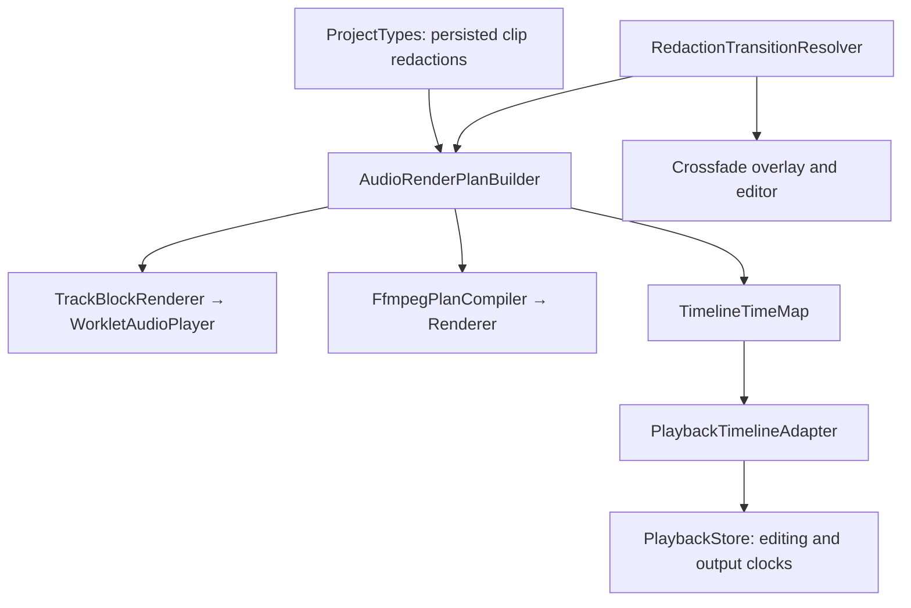

# Redact crossfade implementation and verification

## Delivered behavior

Work began from freshly fetched `origin/main` at `0c28be9dabc8ca3c1573689b69a744ec251c1cc6`, isolated in `codex/redact-crossfade`.
The approved design and execution plan are recorded in [the spec](../specs/2026-09-18-redact-crossfade-design.md) and [the plan](../plans/2026-09-18-redact-crossfade.md).
New redactions default to enabled 30 ms equal-power crossfades; old overlays with absent configuration retain the old behavior.
Clip positions and source media stay unchanged; two 30 ms retained wings overlap for 30 ms in edited playback/export.
UI uses the approved B treatment: square frame, continuous thin rails and outward-fading hatch wings.
The single context-menu entry opens an anchored floating editor; its enabled switch retains duration/curve while disabled.
Ordinary selection exposes redact editing; only crossfade editing exposes envelopes and duration handles.
Gesture drafts preview visually and commit audio settings once on pointerup; Escape cancels an active draft without adding history.
This phase does not introduce normalization, a general plugin registry, or continuous audible audition of uncommitted pointer drafts.

## System boundary

Shared pure code owns eligibility, overlap protection, frame allocation, time mapping and envelope meaning.
The UI consumes resolved ranges and never independently decides acoustic eligibility.
Realtime and offline paths consume the same 48 kHz frame plan, with clip gain and track volume each applied once.
Playback buffering remains bounded to the existing per-track queue limits; PCM reads and plan construction occur outside the AudioWorklet callback.
The obsolete polling/seek preview loop and separate playback segment planner were removed.
Project-owned new/touched subsystem modules use PascalCase; locale resource filenames retain their language-code convention.

## Automated verification

- `npm run format` completed; `npm run check` passed format, ESLint, Knip, TypeScript, 171 test files / 1301 tests and production build.
- Shared-core independent review found negative/fractional reverse-map normalization failure; two observed failing regressions now pass.
- Integration review reproduced stale output duration after paused crossfade edits; explicit output-clock state fixes the observed failing transport regression.
- Final keyboard inspection reproduced body-focused Escape leaking to global deselection; a local guard now exits crossfade editing while retaining the selected redact (observed red/green regression).
- Actual managed FFmpeg linear/equal-power output matches TrackBlockRenderer within `1e-5`, including stereo, unity mono upmix and seek/block envelope phase.
- WAV/FLAC exports retain exactly 83,040 frames in the tested 2 s → 1.73 s case after 44.1 kHz input resampling.
- Raw Worklet queue tests verify overlap PCM, timeline-mode silence, gain applied once, cancellation, prefill acknowledgement and bounded reads.
- A real adapter/raw-player integration test delays PCM prefill while rapidly toggling modes and changing 30/80/60 ms settings; only the newest queue starts, stale reads abort, and the editing position remains 1.5 s (edited output 1.2 s).

## Docker verification

The existing Docker image initially rejected manifest drift; rebuilt using the documented container Dockerfile before testing.
Every final container copied the current source; no host Electron fallback was used.
The broad MCP acceptance run uses `2c5aedb9-50d0-4ee6-8224-e7a8d9c33c6b`; a final focused run verifies the subsequent four-line Escape routing correction.
The audio implementation remained byte-identical across that UI-only correction.
The final product commit is `93ce034`; complete acceptance evidence is in the [final MCP report](../../../.harness-runs/container/90579e11-03f7-4d6a-9e07-0a1ba6669fdd/agent-testing-report.md).
Final source was recopied into a new container after the Escape fix; earlier broad UI/audio runs are explicitly distinguished from this focused replay.

| Check | Result | Retained evidence under `.harness-runs/container/` |
| --- | --- | --- |
| Split, move, save, restart, reopen and real virtual-sink playback | PASS | `d49e84e0-929d-4fae-8dbd-c05e5007b5f5/` |
| Play, pause, paused seek, resume; captured sound and paused silence | PASS | `12fa4608-ba36-4568-905e-c69a924231cf/` |
| Real UI exports with Preview off/on, clip/track mute, natural gaps and retained-track overlap; decoded-content assertions | PASS | `623a504c-a130-4dcb-99c3-521369ffe30a/` |
| Actual crossfade WAV exports with Preview off/on | PASS | `2c5aedb9-50d0-4ee6-8224-e7a8d9c33c6b/exports/` |
| Crossfade UI, persisted settings and final Escape replay | PASS | `b39c7939-2ea6-40f7-8014-4f53fdd01bf5/` |
| Final preview seek-inside, persisted crossing, mute, gap and retained overlap | PASS | `90579e11-03f7-4d6a-9e07-0a1ba6669fdd/` |

Actual UI-produced WAVs with Preview off/on decode to identical PCM.
The disabled hard cut contains 648,008 frames; enabled 30 ms crossfade contains 646,568 frames, exactly 1,440 frames shorter at 48 kHz.
The entire enabled output matches an independently calculated equal-power join within 0.5 PCM16 least-significant bits (rounding tolerance).

Preview seeking into deleted time follows the approved time map: it immediately resolves to the crossfade join rather than holding an impossible deleted output position until Play.
This supersedes the old polling-preview scenario’s paused-inside wording; subsequent playback progression was observed.
Retained overlapping Track 2 audio prevents contraction and the editor reports the protected range.
Muted tracks and natural gaps were observed retaining ordinary timeline progression.

## Known limits

Linux Docker and synthetic/recorded PCM checks do not certify native macOS display/hardware behavior or subjective listening quality.
Lossy-codec encoder padding is not certified by the exact-frame WAV/FLAC comparisons.
Very dense plans need further performance work: review measured about 1.16 s construction at 10,000 redactions; this is not an audio callback benchmark or a verified production deadline failure.
The existing agent scenario documents do not yet encode the new crossfade interaction matrix; targeted checks are recorded without changing those instruction files.

## Final outcome and cleanup

Scoped Docker MCP acceptance is PASS with no unresolved observed product failures.
Every task-owned run was stopped through the harness; an independent Docker container listing confirmed no remaining `redencut-crossfade-acceptance` container.
Other tasks’ containers and the original checkout were left untouched.
The feature branch and worktree are retained for review; dependency/runtime symlinks are local development prerequisites, not committed product files.
