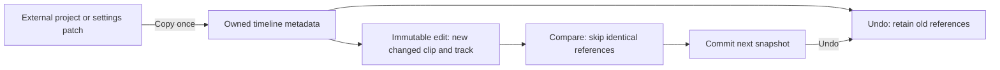

# Timeline CoW improvement — 2026-09-27

## What was already implemented

The existing store retained old timeline references for Undo and rebuilt changed tracks/clips through immutable updates.
It already avoided a full deep copy for every edit; its remaining equality check serialized each changed track as JSON.
This change strengthens snapshot ownership and compares shared branches without serialization.
Undo remains restoration of an old snapshot; no history limit or inverse-command system is introduced.

## How an edit now works



1. Loading a project copies the external timeline once. A settings patch copies its nested values before entering the store, so its caller cannot later change Undo data.
2. Editing creates only the affected objects/arrays. Unchanged clips and tracks remain shared between snapshots.
3. Equality skips shared references and visits changed branches. Property order and absent optional fields versus `undefined` do not create meaningless history entries.
4. Development/test builds recursively freeze timeline metadata at ownership/history boundaries, including import, initialization and Undo/Redo. Previously protected branches are skipped through a WeakSet.
5. Production builds omit freezing. Immutable updates remain necessary; the guard catches violations during development, without adding production traversal cost.

## Reproduce

```sh
npm run profile:timeline
```

The fixture includes effects, clip-owned redactions and crossfade metadata.
Each operation changes one clip on varying tracks and at varying clip positions.
Each strategy is warmed up; forced GC measures additional retained heap after the initial project has been allocated.
The historical deep-copy strategy is simulated for comparison; it is not the implementation immediately before this change.

| Project and edit count | Strategy | Comparison + history p95 | Additional retained heap | Distinct retained clips |
| --- | --- | ---: | ---: | ---: |
| 16 tracks × 100 clips; 60 edits | Whole-timeline JSON + deep copy | 5.675 ms | 46.39 MiB | 97,600 |
| Same | Existing CoW + changed-track JSON | 0.071 ms | 0.071 MiB | 1,660 |
| Same | CoW + shared-branch comparison | 0.017 ms | 0.077 MiB | 1,660 |
| 64 tracks × 300 clips; 40 edits | Whole-timeline JSON + deep copy | 48.650 ms | 369.89 MiB | 787,200 |
| Same | Existing CoW + changed-track JSON | 0.205 ms | 0.126 MiB | 19,240 |
| Same | CoW + shared-branch comparison | 0.016 ms | 0.123 MiB | 19,240 |

Measured locally with Node 24/Vitest; timings and small heap differences vary by machine and GC.
The large-case comparison/history boundary became about 13× faster than the existing CoW comparator.
The large memory saving versus deep copying belongs primarily to CoW already implemented before this change; the two CoW strategies retain the same number of clip objects.

## Limits and verification

This benchmark excludes full TimelineStore operations, linked-Mix synchronization, waveform work, rendering, PCM and development freezing.
It does not establish UI latency or total application memory usage.
Changing an affected track still copies its clip array, and pushing history still creates a new history array; those costs and unlimited history growth remain.
The comparator assumes plain finite serializable timeline metadata; it is not a general comparator for cyclic objects or arbitrary JavaScript classes.

Regression tests cover external-patch ownership, nested snapshot mutation, imported tracks shared with history, loaded-state protection before the first edit, property-order no-ops and production guard bypass.
Full `npm run check`: 211 files / 1594 tests passed, with formatting, lint, dead-code checks, types and build passing.
Docker editing/playback and replacement-waveform E2Es: 5/5 passed.
Both performance commands passed; waveform p95 was 1.687 ms.
The real UI acceptance report is retained in `.harness-runs/container/3e612541-8d31-4d89-acbc-a4307cfa0115/agent-testing-report.md`: import, split/move, Undo/Redo, transport, save/restart/reopen, volume and redaction variations passed; the owned run stopped successfully.
