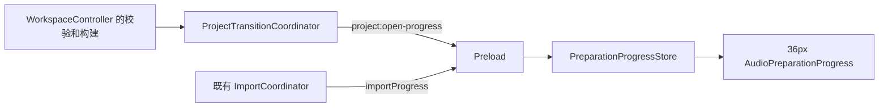

# 音频准备进度：最终实现

## 已确认的交互

打开项目和导入音频共用工具栏下的全宽 36px 单行状态条。
最左侧是占满高度的 36px 等待图标列，后接操作、当前阶段、可截断文件名、打开项目的文件序号、阶段百分比和导入取消按钮。
底边 2px 为进度线；未知比例使用活动线，不估算整体百分比或 ETA。
百分比属于当前文件的当前阶段，构建后再次校验时恢复未知比例；不把构建 100% 当作编辑器已就绪。
长文件名用原生 title 显示全文；沿用应用主题、按钮和中英文语义文案，支持 reduced-motion。

原生文件选择、保存确认和缺失媒体恢复继续使用既有交互。
打开登记时不立即显示，收到真实工作事件才显示；主进程返回后，如需应用会话，则显示“准备编辑器”直到 renderer 完成。
缺失媒体面板打开时显示“等待定位音频”。
导入保留取消，取消请求发出后禁用重复取消，等待原操作 cancelled 或 commit-won 结果；取消请求失败则恢复入口。
本次不添加打开项目取消，也不改变现有编辑、保存、草稿保留和事务语义。

## 架构边界



Main 的 observer 只观察工作；异常发送、窗口销毁或 observer 抛错均不能破坏事务。
WorkspaceController 在当前会话回滚快照准备、目标项目读取、逐文件校验、缓存检查及构建中报告阶段。
Coordinator 增加结算后台任务和切换会话阶段，并为所有事件附加 operationId 和递增 sequence。
既有 FfmpegAudioSourceCacheBuilder 约每 200ms 上报真实帧进度；本次复用回调，不增加解码或磁盘轮询。
普通 describe/save 调用未传 observer 时行为不变。
Starter 的缓存同样在 WorkspaceController 内构建，因此无需修改 createStarterWorkspace。

Renderer 的 store 分开保留 opening/importing，派生一个 active 展示项。
可见的打开操作优先展示；同时仍保留同一行右侧的“取消导入”入口，按 importing 身份取消，不影响 opening 状态。
打开结束后，仍在运行的导入状态恢复主展示位。
打开事件按 operationId 和 sequence 过滤，导入继续按 jobId/workspaceToken/revision 过滤。
已结束操作的迟到事件不能重建状态；进入 preparing-editor 后 main 迟到事件不能覆盖它。
App 仅保留导入忙碌身份，进度 tick 由组件独立订阅，避免每次进度更新都重渲染整个 App。
进度不驱动事务完成：原 Promise 结果仍决定切换、回滚、取消及清理。

## 数据类型

新增 shared/AudioPreparationTypes.ts：

```ts
type StageProgress =
  | { kind: 'indeterminate' }
  | { kind: 'determinate'; fraction: number }

type ProjectOpenStage =
  | 'reading-project' | 'waiting-for-media' | 'verifying-audio'
  | 'checking-cache' | 'building-cache' | 'settling-jobs' | 'switching-session'

interface ProjectOpenProgressEvent {
  operationId: string
  sequence: number
  stage: ProjectOpenStage
  projectDisplayName?: string
  source?: {
    audioSourceId: AudioSourceId
    displayName: string
    index: number // 1-based，当前文件序号
    total: number
  }
  progress: StageProgress
}
```

OpenProjectRequest 增加必填 operationId，IPC 在手动、pending 和 starter 入口验证它。
IElectronAPI.on 新增 projectOpenProgress(callback)，返回解除订阅函数。
内部 observer 使用 Omit<ProjectOpenProgressEvent, 'operationId' | 'sequence'>。
Renderer 另有 preparing-editor/cancelling 展示状态，导入继续使用原 ImportProgressEvent。
不修改 ProjectFileSchema、RendererSession、AudioSourceCacheDescriptor、cache manifest 或持久化格式，无迁移。

## 文件变化

```text
src/shared/
  AudioPreparationTypes.ts                         新增：阶段、比例、打开事件
  session.types.ts                                修改：请求 operationId
  ipc.types.ts                                    修改：事件订阅
  i18n/locales/{en,zh-CN}.ts                        修改：进度语义文案
  i18n/locales/resources.test.ts                   修改：语言分组完整性
src/main/
  project/WorkspaceController.ts                  修改：观察真实工作
  project/ProjectTransitionCoordinator.ts          修改：身份、阶段、事件发送
  project/SessionSwitchBarrier.ts                  修改：sender 事件值类型
  ipc/project.ipc.ts                              修改：验证请求身份
src/preload/index.ts                               修改：窄事件桥
src/renderer/src/
  stores/PreparationProgressStore.ts               新增：瞬时展示状态
  components/audio-preparation/
    AudioPreparationProgress.tsx                   新增：36px 单行展示
    AudioPreparationProgress.css                   新增：主题、动画、布局
  App.tsx                                         修改：生命周期接线
```

测试与模块相邻：新增 store/component 测试，扩展 App、WorkspaceController、ProjectTransitionCoordinator、project.ipc 测试。
FfmpegAudioSourceCacheBuilder、ImportCoordinator、main/index 和 createStarterWorkspace 业务实现保持不变。

## 风险和验证边界

重点覆盖缓存命中与重建、多源序号、observer 失败、取消与提交竞态、旧事件、renderer 延迟就绪以及打开/导入重叠。
项目打开错误、源文件缺失、回滚、任务结算继续遵守既有行为；真实文件选择器与主机无障碍行为需在目标 OS 验证。
快速阶段可能来不及肉眼看见，不人为延长等待；反馈解决可见性，不承诺缩短原有校验耗时。
验证结果和截图保存在本任务 Docker MCP 的 agent-testing-report.md；未观察到的状态需在报告中明确标出。
