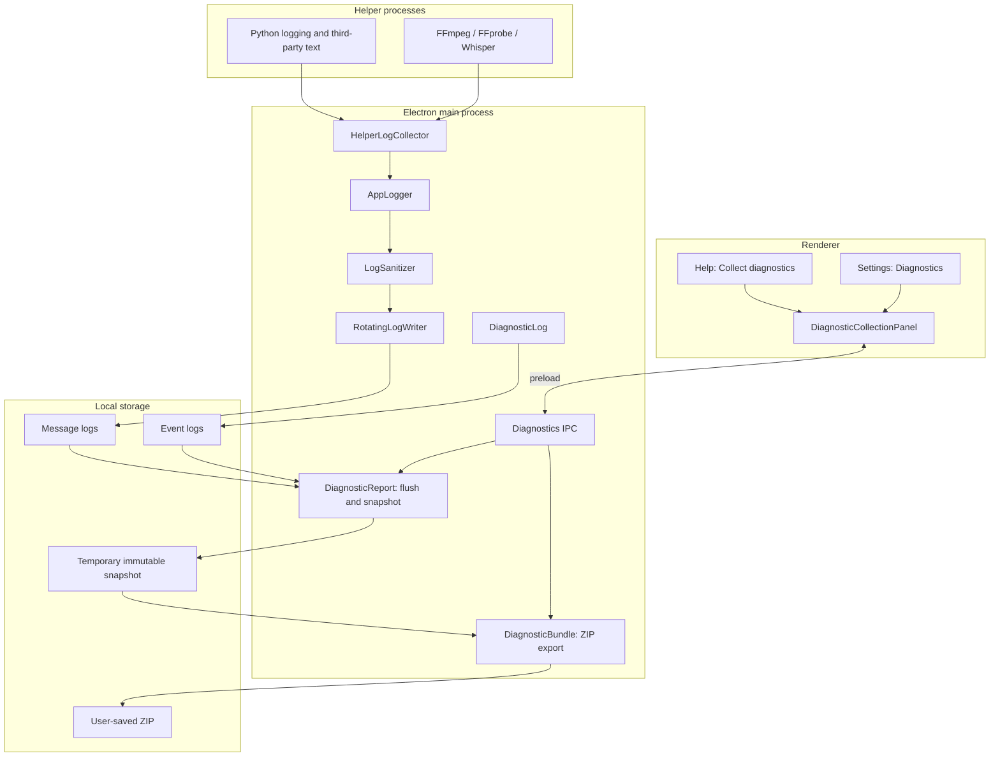

# Application Logging and Diagnostic Collection

Date: 2026-09-28
Status: Conversation design approved; written specification awaiting review.

## Goal and scope

Give users one locally saved diagnostic bundle containing retained important events and application messages, warnings, errors, and available exception stacks from the main process and helper processes.
Collect logs during normal operation so a user can export immediately after a problem without first enabling logging or reproducing the problem.
Keep collection bounded and avoid blocking audio, speech processing, or user interaction on filesystem writes.
Help and Settings provide the same diagnostic collection behavior even when no failure ID exists.
README guidance and a simple GitHub bug form explain duplicate search, collection, attachment, and submission.
This extends the existing application diagnostics design and supersedes its operation-only JSON export and prohibition on all exception messages and stacks.
It preserves typed public errors, existing failure classification, and one terminal event per reportable failure.

Renderer console capture, automatic uploads, an in-app bug description form, operating-system log collection, crash dumps, and a user-configurable debug mode are outside this change.
The application does not deliberately record audio, transcripts, full project contents, protocol result payloads, environment dumps, or credentials.

## Architecture



### AppLogger and main-process callers

Main-process business code explicitly calls AppLogger instead of console.log/info/warn/error.
Do not globally override console methods.
Use scoped logger instances with component and optional operation context; avoid introducing logger dependencies into pure domain calculations.
Default collection includes info, warn, and error.
Log exceptions with bounded message, stack, and cause traversal without invoking arbitrary getters or serializing entire objects.
Logging is best effort and must not throw into the original operation.
Retain a direct stderr/console fallback only for logger failures or startup before initialization, avoiding recursive logging.
Initialize collection after harness log-path isolation and before ordinary application services; retain a bounded startup buffer for messages emitted through AppLogger before file initialization.
Do not claim capture of failures before the application can initialize its logging code.
Normal shutdown requests a bounded flush after owned operations have settled.

### Helper collection

Helper processes emit diagnostic output; the main process owns files, rotation, and export.
HelperLogCollector receives chunks, uses bounded UTF-8-aware incremental decoding, splits lines across chunk boundaries, and flushes a final unterminated line on settlement.
Handle carriage-return progress updates without preserving every redraw; retain finite progress summaries and a final update.
Preserve genuine diagnostic lines around progress output rather than discarding all lines containing percentages.
Cap partial-line storage and record truncation rather than accumulating an arbitrarily long line.
Always drain pipes independently of the file writer; logger saturation must not pause a helper pipe.

Python stdout remains the existing JSONL task protocol.
Python logging emits versioned log envelopes to stderr with explicit level, logger name, message, and optional stack.
Python logging integration covers standard logging and warnings; exceptions caught at the worker boundary produce a diagnostic stack before the existing safe error response.
Third-party print output remains redirected to stderr and is collected as text.
Nonconforming or oversized stderr envelopes fall back to bounded text rather than failing the task.
Python debug records are disabled by default; info/warning/error/critical are normalized to info/warn/error.

FFmpeg, FFprobe, and Whisper adapters collect diagnostic text while maintaining current progress and result handling.
Do not collect binary stdout, transcript results, arbitrary ffprobe JSON, or Python protocol payloads as messages.
Use helper-specific level options to retain warnings/errors and useful startup messages without enabling verbose frame/sample output.
Where text lacks trustworthy level metadata, record info with stream=stderr rather than asserting it is an error.
Record helper start, settlement, exit code, and signal through safe summaries without dumping full commands containing private paths or arguments.
Python stderr is not inherently an error channel.
All application-owned runtime helper launch paths, including resource validation probes, must be audited for collection coverage; development CLI setup commands are not automatically included.

## Data contracts

Persisted contracts use Zod schemas with inferred TypeScript types and versioned, bounded fields.
Definitions of reused identifiers belong in their owning contracts.

### AppLogMessage

AppLogEvent remains a structured, named business milestone with allowlisted facts.
AppLogMessage is the separate textual application-log record; a new warning sentence does not require a new AppLogEvents enum entry.
Both belong to application logging; source distinguishes main and helper processes.

```ts
type LogLevel = 'info' | 'warn' | 'error'
type LogSource = 'main' | 'python' | 'ffmpeg' | 'ffprobe' | 'whisper'

interface AppLogMessage {
  schemaVersion: 1
  time: string
  sessionId: string
  sequence: number
  level: LogLevel
  source: LogSource
  component?: string
  stream?: 'stdout' | 'stderr'
  operationId?: string
  helperInstanceId?: string
  message: string
  stack?: string
  truncated?: boolean
}

interface PythonLogMessage {
  type: 'log'
  version: 1
  level: LogLevel
  logger: string
  message: string
  stack?: string
}
```

Main assigns receive time and per-session sequence so simultaneous sources have a deterministic arrival order without claiming true cross-process execution order.
Session and helper IDs are random and contain no user data.
Main hashes operation correlation IDs using the same transformation as the event log, exactly once per record.
An operation-scoped logger carries correlation to helper instances; overlapping jobs must not share mutable global operation context.
Python envelopes are validated at ingestion; Python does not supply final application session, sequence, or operation identity.
No arbitrary data object is part of the record contract.

### Writer options and bounds

```ts
interface LogWriterOptions {
  maxRecordBytes: number
  maxQueueBytes: number
  priorityReserveBytes: number
  flushIntervalMs: number
  batchBytes: number
  maxFileBytes: number
  maxFiles: number
  maxAgeDays: number
  shutdownFlushTimeoutMs: number
}
```

Initial defaults: 16 KiB per serialized record, 512 KiB total queue including 128 KiB reserved for warn/error, flush every 500 ms or at 64 KiB, five approximately 4 MiB message files, fourteen-day retention, and two-second shutdown flush timeout.
These are internal defaults to validate under stress, not user settings.
Keep the existing independent event-log retention budget; ordinary helper text cannot evict event records.
Track bytes rather than only record counts.
If the queue saturates, reject or evict info first while preserving accepted-order among remaining records; when all available capacity contains priority records, dropping warn/error remains possible and must be counted.
Emit bounded loss summaries once capacity returns, without allowing summaries to recursively generate loss summaries.
Track truncation, dropped records by level, and write failures with persistent markers where possible.
Do not report an unknown counter as zero.

Use serial asynchronous writes and bounded batches; avoid per-message readdir/stat/pruning.
Check retention at initialization, rotation, and controlled periodic intervals.
Flush means all accepted records through a captured cutoff have been processed by the writer, with failures reported; it does not promise physical-disk fsync durability.
Abrupt termination can lose the last pending batch.
Do not retry filesystem failures indefinitely or retain unbounded pending promises; collect subsequent failures through bounded accounting and a nonrecursive fallback.

### Diagnostic request, manifest, and preview

```ts
type DiagnosticCollectionRequest =
  | { kind: 'recent' }
  | { kind: 'failure'; diagnosticIds: string[] }

interface DiagnosticBundleManifest {
  bundleVersion: 1
  generatedAt: string
  environment: {
    appVersion: string
    platform: string
    osVersion: string
    architecture: string
  }
  diagnosticIds: string[]
  files: Array<{
    path: string
    kind: 'events' | 'runtime'
    bytes: number
  }>
  coverage: {
    from?: string
    to?: string
    scope: 'retained-history'
  }
  losses: {
    droppedRecords: { info: number; warn: number; error: number }
    truncatedRecords: number
    writeFailures: number
    countersComplete: boolean
  }
  warnings: string[]
}

interface DiagnosticReportPreview {
  previewId: string
  manifest: DiagnosticBundleManifest
  totalBytes: number
}
```

Recent collection does not require a diagnostic ID.
Failure collection validates and deduplicates the requested IDs within the existing twenty-ID limit, and identifies missing selected failure events.
Both include all retained event/message history rather than filtering messages to an operation ID.
The manifest lists payload files; manifest.json is not included in its own file list.
totalBytes describes total uncompressed snapshot size including manifest.json, not an estimated ZIP size.
Coverage reflects available records and the actual captured cutoff; historical log retention is finite.
Warnings are named stable codes for missing selected history, unavailable logs, incomplete snapshots, and known losses.
The counters describe the snapshot scope where evidence permits; countersComplete is false if history or failed persistence prevents a complete accounting.

## Snapshot and export

DiagnosticReport coordinates writer flushes and makes an immutable temporary snapshot under app-owned isolated storage.
Bound both concurrent retained previews and their lifetime: at most two snapshots with ten-minute expiration; reject additional preparation with a recoverable public error until one is released or expires.
Main serializes access to source files during snapshot copying so append and rotation cannot mutate or remove files being copied.
Log acceptance and helper pipe draining remain nonblocking, subject to the bounded queue; the snapshot barrier is released before ZIP compression.
Use bounded streaming copying and compression, not reading all history into one string or renderer state.
Legacy event history and new records remain readable; parse and omit invalid records with an explicit warning rather than allowing arbitrary files to enter the bundle.
Source paths come only from application-owned log inventories.
Snapshot and ZIP entries use fixed safe relative names, never paths supplied by the renderer.
The implementation plan selects a maintained ZIP library and verifies its streaming behavior and license; no bespoke ZIP format implementation is required.

Bundle layout:

```text
redencut-diagnostics-<timestamp>.zip
├── manifest.json
├── events/application*.jsonl
└── runtime/runtime*.jsonl
```

Snapshot creation is bounded by log retention budgets and explicit record limits.
Use application-owned temporary output and atomic finalization when saving so a failed write does not leave a falsely successful bundle; do not destroy a preexisting destination on failure.
Cancellation of the native save dialog leaves the snapshot available for another save attempt.
Save, reveal, and inspect operations accept only opaque preview IDs and validate caller ownership and expiration.
Opening the snapshot directory reveals the exact sanitized payload represented by the preview.
Close, expiration, shutdown, and startup cleanup remove owned temporary snapshots; saved user bundles are never cleaned up by the application.

## Privacy and public errors

Sanitize before persistence, not only at export.
Bound formatting and cause traversal; remove known credential patterns and configured sensitive values, redact user-home/private filesystem paths, and retain useful package-relative stack locations where possible.
Do not automatically log complete helper commands, environment variables, project state, transcript payloads, or arbitrary objects.
Free-form third-party text cannot be guaranteed to contain no sensitive information; disclose that users should inspect collected files before sharing.
Never continue claiming that full exception/text logs are absolutely free of paths or sensitive content.
Public operation errors remain allowlisted and localized; message logs do not become raw UI error strings.
The app never uploads collected logs.

## User flow

Use Diagnostics / 诊断 as the Settings section and Collect diagnostics… / 收集诊断信息… as the action.
The native Help action opens DiagnosticReportDialog, which hosts DiagnosticCollectionPanel and begins preparing a recent snapshot.
Settings gains a Diagnostics tab with the same collect action; after activation it hosts the shared panel inline rather than nesting modal dialogs.
Existing single/batch failure buttons host the same panel with a failure request and preserve associated IDs.
Remove the recent-failure prerequisite from Help; no previous error must not result in a silent no-op.

The panel shows preparing, ready, or recoverable preparation error state.
Ready state presents retained scope, file list, uncompressed size, missing/truncated log warnings, privacy guidance, Inspect collected files, and Save actions.
Save opens a localized native ZIP destination dialog; save cancellation is ordinary cancellation.
Save failures allow another destination; success offers Show in Finder (or platform equivalent).
Changing language retranslates labels without restarting collection.
Opening or closing collection does not modify projects, restart analysis, or change playback.
The renderer receives the manifest and opaque ID, not all log bytes or an arbitrary filesystem path.

## File responsibilities

Add src/main/logging/AppLogger.ts, LogSanitizer.ts, and RotatingLogWriter.ts with focused tests.
Add src/main/processes/HelperLogCollector.ts and tests; integrate ManagedProcess plus helper launchers that bypass it without unrelated process refactoring.
Add src/main/diagnostics/DiagnosticBundle.ts and tests; extend DiagnosticReport and DiagnosticLog for snapshot export.
Add shared AppLogMessageTypes.ts and DiagnosticBundleTypes.ts; update existing diagnostics and IPC contracts, preload, and associated tests together.
Add Python logging_setup.py and tests; initialize it and log caught worker failures in __main__.py without modifying stdout task protocol semantics.
Migrate main-process business console call sites to explicit scoped AppLogger usage, including IPC diagnostic sinks and lifecycle reports.
Update index.ts initialization/shutdown, ProjectMenu.ts, App.tsx, diagnostic IPC, localized resources, and existing tests.
Add DiagnosticCollectionPanel.tsx and DiagnosticsSettings.tsx; adapt DiagnosticReportDialog.tsx and SettingsDialog.tsx.
Update architecture standards to describe actual collection, privacy limits, and ZIP behavior; do not modify instruction files.

## Bug-report guidance

README explains searching all issues including closed issues using the action, symptom, and available error code; per-failure diagnostic IDs are not duplicate-search keys.
Use natural titles such as Generating a transcript gets stuck; no required feature prefix or internal feature taxonomy.
The GitHub bug form asks how the issue was encountered, actual/expected behavior, and app/OS versions, with optional diagnostic ZIP and screenshots.
No logs is a valid report; users do not need to know the internal feature name.
Explain both collection entry points, inspection, saving, dragging the ZIP into GitHub, waiting for attachment upload, and submitting.
Do not equate opening GitHub or exporting a ZIP with creating an issue.

## Verification and acceptance

Test ordering/correlation across simultaneous helper instances, startup initialization, fragmented UTF-8, multiline stacks, unterminated lines, huge lines, malformed Python envelopes, and progress redraws.
Verify no protocol JSON, binary audio, or deliberate transcript/result data is collected.
Test redaction before persistence, priority saturation and loss accounting, slow/failed filesystems, bounded retries, rotation, age retention, and concurrent snapshot/rotation.
Stress collection with a noisy helper and slow writer; verify queue memory remains bounded, helper completes, and loss metadata is accurate rather than asserting performance from asynchronous API usage alone.
Compare representative helper tasks with collection enabled/disabled and report measured overhead; limit changes require evidence.
Test immutable previews, ZIP extraction/content, retention bounds, no-ID collection, selected missing failures, cancellation, save failure/retry, expiration, ownership, and cleanup.
Test UI keyboard accessibility, localization, both entry points, shared states, and existing failure export.
Run format and npm run check plus relevant Python tests.
Use the project agent-testing workflow and Docker MCP baseline plus changed-behavior checks for Help, Settings, inspection, saved bundle, cancellation, and retry.
Propose a durable diagnostic-collection scenario and obtain confirmation before adding it; targeted UI checks remain required regardless of scenario-file approval.
Document blocked or unverified checks and link evidence-backed acceptance results.

## Review and next stage

The user has approved architecture, explicit AppLogger migration, AppLogEvent/AppLogMessage naming, helper collection, bounded asynchronous writing, ZIP export, and both Diagnostics entry points in conversation.
Review this written specification before producing the implementation plan.
Product implementation has not started.
